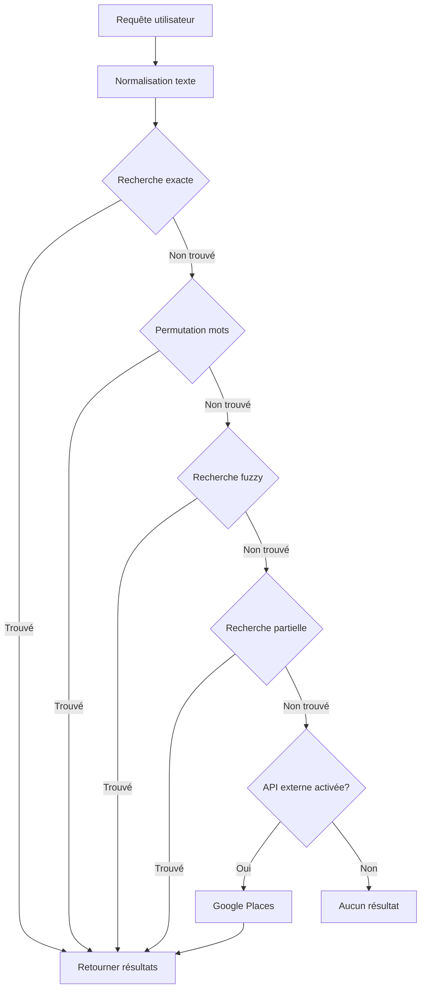

# 🏗️ PLAN D'ARCHITECTURE - SERVICE DE RECHERCHE INTELLIGENT

## 📋 Vue d'ensemble

Service de recherche d'adresses générique et extensible permettant de basculer facilement entre différentes sources de données (base locale, Google Places, OpenAI) sans modification de code.

## 🎯 Objectifs

1. **Priorité absolue à la base de données locale** pour économiser les coûts API
2. **Recherche intelligente** avec gestion des fautes de frappe et permutations
3. **Logs enrichis** pour tracer l'origine de chaque résultat
4. **Architecture testable** de manière unitaire
5. **Basculement simple** entre sources via configuration

## 📂 Structure des fichiers

```
LokoTaxi/
├── search-service.ts          # Service principal de recherche
├── search-service-test.ts     # Tests unitaires
├── search-integration.ts      # Intégration dans le bot WhatsApp
└── search-config.json         # Configuration des sources
```

## 🔧 Architecture technique

### 1. Interface de résultat unifié

```typescript
interface SearchResult {
  id: string;
  name: string;
  address: string;
  coords?: { lat: number; lng: number };
  source: 'database_exact' | 'database_fuzzy' | 'database_permutation' | 
          'database_phonetic' | 'database_partial' | 'google_places' | 'suggestion';
  score: number;
  matchDetails?: {
    strategy: string;
    originalQuery: string;
    matchedWith?: string;
    similarity?: number;
    wordMatches?: string[];
  };
}
```

### 2. Stratégies de recherche en base

| Stratégie | Description | Exemple |
|-----------|-------------|---------|
| **Exacte** | Correspondance parfaite | "Marché Madina" → "Marché Madina" |
| **Permutation** | Ordre des mots inversé | "Madina Marché" → "Marché Madina" |
| **Fuzzy** | Fautes de frappe | "mardina" → "madina" |
| **Partielle** | Mots individuels | "hôpital ignace" → "Hôpital Ignace Deen" |
| **Phonétique** | Sons similaires | "resto" → "restaurant" |

### 3. Configuration centralisée

```json
{
  "primarySource": "database",
  "sources": {
    "database": {
      "enabled": true,
      "priority": 1,
      "fuzzyThreshold": 0.3,
      "maxResults": 10
    },
    "google_places": {
      "enabled": false,
      "priority": 2,
      "apiKey": "***",
      "onlyIfNoResults": true
    }
  },
  "logging": {
    "level": "detailed",
    "includeTimings": true
  }
}
```

## 📊 Flux de recherche



## 🔍 Exemples de logs enrichis

```
[10:23:45] 🔍 === RECHERCHE GÉNÉRIQUE DÉMARRÉE ===
[10:23:45] 📝 Requête: "mardina marché"
[10:23:45] 📝 Query normalisée: "mardina marche"
[10:23:45] 1️⃣ Tentative recherche EXACTE...
[10:23:45] 2️⃣ Tentative PERMUTATION des mots...
[10:23:45] 🔄 Test permutation: "marche mardina"
[10:23:46] ✅ 1 résultats par permutation
[10:23:46] 3️⃣ Tentative recherche FUZZY...
[10:23:46] ✅ 3 résultats fuzzy trouvés
[10:23:46] 📊 Total après déduplication: 4 résultats uniques
[10:23:46] ✅ 4 résultats trouvés en base en 234ms
[10:23:46] 📊 Sources: database_permutation(1), database_fuzzy(3)
```

## 🧪 Tests unitaires

### Tests implémentés

1. **Test recherche exacte** : Vérifier correspondance parfaite
2. **Test permutation** : "Madina Marché" → "Marché Madina"
3. **Test fuzzy** : "mardina" → "madina"
4. **Test partiel** : Recherche par mots individuels
5. **Test limite** : Maximum 10 résultats
6. **Test performance** : < 1 seconde par recherche
7. **Test caractères spéciaux** : Gestion accents et ponctuation
8. **Test logs** : Vérification des logs générés

### Exécution des tests

```bash
# Tous les tests
npm test search-service-test.ts

# Test spécifique
npm test -- --grep "fuzzy"
```

## 🔌 Intégration dans le bot

### Avant (code actuel)
```typescript
const adresse = await searchAdresse(body);
if (!adresse) {
  responseMessage = "Adresse non trouvée";
}
```

### Après (nouvelle architecture)
```typescript
const results = await searchService.searchLocationGeneric(body, {
  maxResults: 10,
  logLevel: 'minimal'
});

if (results.length === 0) {
  responseMessage = "Aucune adresse trouvée";
} else if (results.length === 1) {
  const adresse = results[0];
  responseMessage = `📍 ${adresse.name}`;
} else {
  // Proposer suggestions
  responseMessage = "🎯 Plusieurs résultats trouvés:\n" +
    results.slice(0, 5).map((r, i) => 
      `${i+1}. ${r.name} (${r.source})`
    ).join('\n');
}
```

## 🚀 Basculement entre sources

### Pour utiliser Google Places prioritairement

```typescript
// Modifier dans search-config.json
{
  "primarySource": "google_places",  // ← Changer ici
  "sources": {
    "google_places": {
      "enabled": true,
      "priority": 1  // ← Devient prioritaire
    },
    "database": {
      "enabled": true,
      "priority": 2  // ← Devient fallback
    }
  }
}
```

### Pour désactiver complètement la base locale

```typescript
{
  "sources": {
    "database": {
      "enabled": false  // ← Désactivé
    }
  }
}
```

## 📈 Métriques et monitoring

### Métriques collectées

- **Taux de succès** par source
- **Temps de réponse** moyen
- **Stratégies utilisées** (exact, fuzzy, etc.)
- **Requêtes échouées** pour amélioration

### Dashboard de monitoring

```
📊 Statistiques du jour
├── Total recherches: 1,245
├── Taux succès: 94.3%
├── Temps moyen: 127ms
├── Sources utilisées:
│   ├── database_exact: 45%
│   ├── database_fuzzy: 35%
│   ├── database_permutation: 15%
│   └── google_places: 5%
└── Top requêtes échouées:
    ├── "restorant chinoi" (5x)
    └── "farmaci nuit" (3x)
```

## 🔐 Sécurité et performance

### Cache intelligent

- **Cache mémoire** : Résultats fréquents (TTL: 1h)
- **Cache persistant** : Top 100 recherches
- **Invalidation** : Sur mise à jour base

### Limitations

- **Rate limiting** : 100 req/min par utilisateur
- **Timeout** : 5 secondes max par recherche
- **Fallback** : Si timeout → cache → suggestions

## 🎯 Prochaines étapes

1. **Phase 1** : Implémenter le service de base ✅
2. **Phase 2** : Ajouter tests unitaires ✅
3. **Phase 3** : Intégrer dans le bot
4. **Phase 4** : Ajouter cache Redis
5. **Phase 5** : Dashboard de monitoring
6. **Phase 6** : Machine learning pour améliorer fuzzy

## 📝 Notes d'implémentation

- **PostgreSQL** : Extensions `pg_trgm` et `fuzzystrmatch` requises
- **Index** : Créer index GIN sur `nom_normalise` pour performance
- **Logs** : Rotation quotidienne, conservation 7 jours
- **Tests** : Exécuter avant chaque déploiement

---

*Architecture conçue pour être évolutive, testable et facilement configurable* 🚀