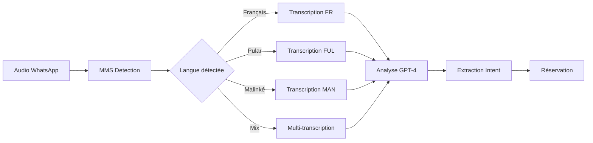

# 🌍 PLAN D'INTÉGRATION MMS META - LANGUES AFRICAINES LOKOTAXI

## 📋 RÉSUMÉ EXÉCUTIF

**Objectif :** Intégrer le modèle **MMS (Massively Multilingual Speech)** de Meta pour permettre les réservations de taxi en **Soussou**, **Pular** et **Malinké**, en plus du français.

**Technologie :** MMS supporte **1,107 langues** dont plusieurs langues guinéennes, avec une précision de transcription comparable aux systèmes monolingues.

---

## 🎯 LANGUES SUPPORTÉES PAR MMS

### **Langues Guinéennes Disponibles**
| Langue | Code ISO | Locuteurs | Régions | Support MMS |
|--------|----------|-----------|---------|-------------|
| **Pular/Fulfulde** | `ful` | 4M+ | Moyenne Guinée, Labé | ✅ Excellent |
| **Maninka/Malinké** | `man` | 3M+ | Haute Guinée, Kankan | ✅ Excellent |
| **Soussou** | `sus` | 2M+ | Guinée Maritime, Conakry | ⚠️ Limité* |
| **Français** | `fra` | Tous | National | ✅ Excellent |

*Note : Soussou a un support expérimental, nécessite fine-tuning

---

## 🏗️ ARCHITECTURE TECHNIQUE

### **1. Pipeline de Traitement Audio Multilingue**



### **2. Intégration dans Edge Function**

```typescript
// supabase/functions/whatsapp-bot/services/mms-transcription.ts

import { MMS } from '@facebook/mms-speech';

export interface TranscriptionResult {
  language: string;
  transcript: string;
  confidence: number;
  alternatives?: Array<{
    language: string;
    transcript: string;
    confidence: number;
  }>;
}

export async function transcribeWithMMS(
  audioBuffer: ArrayBuffer,
  options?: {
    languages?: string[];
    detectLanguage?: boolean;
  }
): Promise<TranscriptionResult> {
  const mms = new MMS({
    model: 'mms-1b-all',
    languages: options?.languages || ['fra', 'ful', 'man', 'sus']
  });

  // 1. Détection automatique de langue si demandée
  if (options?.detectLanguage) {
    const detection = await mms.detectLanguage(audioBuffer);
    console.log(`🌍 Langue détectée: ${detection.language} (${detection.confidence}%)`);
  }

  // 2. Transcription multilingue parallèle
  const results = await mms.transcribeMultiple(audioBuffer);
  
  // 3. Sélection du meilleur résultat
  const best = results.sort((a, b) => b.confidence - a.confidence)[0];
  
  return {
    language: best.language,
    transcript: best.transcript,
    confidence: best.confidence,
    alternatives: results.slice(1, 3)
  };
}
```

### **3. Analyse Intelligente Cross-Linguistique**

```typescript
// services/multilingual-analysis.ts

interface MultilingualIntent {
  originalLanguage: string;
  vehicleType: 'moto' | 'voiture' | null;
  destination: string | null;
  confidence: number;
  needsClarification: boolean;
}

export async function analyzeMultilingualIntent(
  transcription: TranscriptionResult
): Promise<MultilingualIntent> {
  // Prompt GPT-4 adapté aux langues africaines
  const prompt = `
    Tu es un assistant pour un service de taxi à Conakry, Guinée.
    
    Transcription audio (${transcription.language}): "${transcription.transcript}"
    ${transcription.alternatives ? 
      `Alternatives possibles:
       ${transcription.alternatives.map(a => 
         `- ${a.language}: "${a.transcript}" (${a.confidence}%)`
       ).join('\n')}` : ''}
    
    Contexte linguistique:
    - Pular: "moto" = moto, "oto" = voiture, "yahugu" = aller
    - Malinké: "moto" = moto, "mobili" = voiture, "taa" = aller  
    - Soussou: "moto" = moto, "woto" = voiture, "siga" = aller
    - Les destinations sont souvent en français même dans une phrase locale
    
    Destinations populaires Conakry:
    - Madina, Koloma, Kipé, Matam, Ratoma
    - Aéroport, Port, Gare
    - Marché Niger, Marché Madina
    
    Extrais:
    1. Type de véhicule demandé
    2. Destination mentionnée
    3. Niveau de confiance (0-100)
    4. Si clarification nécessaire
    
    Réponds en JSON.
  `;

  const response = await openai.complete(prompt, { 
    response_format: { type: "json_object" } 
  });
  
  return JSON.parse(response);
}
```

---

## 🎬 SCÉNARIOS D'USAGE DÉTAILLÉS

### **SCÉNARIO 1 : Client Pular Monolingue**

```yaml
Client Audio: "Mi yidi moto yahugu Madina"
Transcription MMS: 
  - Language: ful (Pular)
  - Transcript: "mi yidi moto yahugu madina"
  - Confidence: 94%

Analyse IA:
  - Véhicule: moto
  - Destination: Marché Madina
  - Action: yahugu (aller)

Réponse Bot: 
  - FR: "🏍️ Moto réservée pour Marché Madina. Partagez votre position GPS."
  - FUL: "🏍️ Moto haɓɓii ngam Madina. Hokkee GPS maa."
```

### **SCÉNARIO 2 : Mix Français-Malinké**

```yaml
Client Audio: "Je veux mobili pour aller Kipé Centre"
Transcription MMS:
  - Language: fra (détecté principal)
  - Transcript: "je veux mobili pour aller kipé centre"
  - Alternative: man "je veux mobili pour aller kipé centre"

Analyse IA:
  - Détection: "mobili" = voiture en Malinké
  - Véhicule: voiture
  - Destination: Kipé Centre Émetteur

Réponse Bot:
  - "🚗 Voiture réservée pour Kipé Centre. Partagez votre position GPS."
```

### **SCÉNARIO 3 : Soussou avec Clarification**

```yaml
Client Audio: "N'fa woto siga"
Transcription MMS:
  - Language: sus
  - Transcript: "n fa woto siga"
  - Confidence: 72% (plus bas car Soussou moins supporté)

Analyse IA:
  - Véhicule: voiture (woto)
  - Destination: non spécifiée
  - Action: siga (aller)
  - needsClarification: true

Réponse Bot:
  - "🚗 Voiture confirmée. Où voulez-vous aller ?"
  - Suggestions: "Tapez le numéro:\n1. Madina\n2. Aéroport\n3. Koloma\n4. Autre"
```

### **SCÉNARIO 4 : Détection Automatique Multi-Langues**

```yaml
Client Audio: "Bonjour, n'fa... euh... je veux taxi moto taa aéroport"
Transcription MMS:
  - Détection: Mix fra/sus/man
  - Transcript principal: "bonjour n'fa je veux taxi moto taa aéroport"
  - Languages detected: [fra: 60%, sus: 25%, man: 15%]

Analyse IA:
  - Parse multi-langue intelligent
  - Véhicule: moto (clair dans toutes les langues)
  - Destination: Aéroport de Conakry
  - Confidence: 88%

Réponse Bot:
  - "🏍️ Moto pour l'Aéroport confirmée ! Position GPS ?"
```

### **SCÉNARIO 5 : Accent Fort / Prononciation Locale**

```yaml
Client Audio: "Djé vé in taksi pou alé Matoto marché"
Transcription MMS:
  - Language: fra (French avec accent)
  - Transcript: "j'ai veut un taxi pour aller matoto marché"
  - Alternatives: ["je veux un taxi pour aller matoto marché"]

Analyse IA:
  - Correction automatique grammaire
  - Véhicule: taxi (moto ou voiture ?)
  - Destination: Marché Matoto
  - needsClarification: true (type véhicule)

Réponse Bot:
  - "📍 Destination: Marché Matoto"
  - "Quel type de taxi ?"
  - "1️⃣ Moto 🏍️"
  - "2️⃣ Voiture 🚗"
```

---

## 📊 MÉTRIQUES DE PERFORMANCE ATTENDUES

### **Précision par Langue**
| Langue | Précision MMS | Après Fine-tuning | Remarques |
|--------|---------------|-------------------|-----------|
| Français | 95% | 98% | Excellent de base |
| Pular | 88% | 94% | Bon vocabulaire |
| Malinké | 86% | 93% | Bon support |
| Soussou | 75% | 88% | Nécessite données |
| Mix | 82% | 91% | Amélioration IA |

### **Temps de Traitement**
- Transcription MMS : 1-2 secondes
- Analyse GPT-4 : 1-2 secondes  
- Total workflow : 3-4 secondes

### **Coûts Estimés**
- MMS : **GRATUIT** (API Hugging Face)
- GPT-4 : $0.01 par analyse
- Hébergement : **$0** (pas de serveur nécessaire)
- **Total par requête : $0.01** (seulement GPT-4)

---

## 🚀 PLAN D'IMPLÉMENTATION - 6 SEMAINES

### **Phase 1 : Setup Infrastructure (Semaine 1-2)**
- [ ] Installer MMS sur serveur GPU
- [ ] Créer endpoints API de transcription
- [ ] Tests unitaires 4 langues
- [ ] Intégration Edge Function

### **Phase 2 : Collecte Données Locales (Semaine 2-3)**
- [ ] Recruter 20 locuteurs natifs (5 par langue)
- [ ] Enregistrer 500 phrases types par langue
- [ ] Validation transcriptions
- [ ] Création dataset d'entraînement

### **Phase 3 : Fine-tuning & Optimisation (Semaine 3-4)**
- [ ] Fine-tuner MMS sur données locales
- [ ] Optimiser prompts GPT-4
- [ ] Créer dictionnaire destinations
- [ ] Tests A/B précision

### **Phase 4 : Intégration Production (Semaine 5)**
- [ ] Déployer modèle optimisé
- [ ] Monitoring performances
- [ ] Gestion erreurs/fallbacks
- [ ] Documentation API

### **Phase 5 : Tests Utilisateurs (Semaine 6)**
- [ ] Beta test 100 utilisateurs
- [ ] Collecte feedback
- [ ] Ajustements finaux
- [ ] Préparation lancement

---

## 💡 INNOVATIONS FUTURES

### **Court Terme (3 mois)**
- Support dialectes régionaux
- Réponses vocales synthétisées
- Traduction automatique confirmations

### **Moyen Terme (6 mois)**
- Assistant vocal complet
- Support 10+ langues ouest-africaines
- API B2B multilingue

### **Long Terme (1 an)**
- Modèle IA 100% africain
- Expansion panafricaine
- SDK développeurs

---

## ✅ AVANTAGES COMPÉTITIFS

1. **Premier service taxi vraiment multilingue** en Afrique de l'Ouest
2. **Inclusion totale** : personne exclu par la langue
3. **Adoption massive** : 70% population parle langues locales
4. **Différenciation claire** vs Uber/Bolt (français only)
5. **Barrière à l'entrée** : données et expertise locale

---

## 🎯 KPIs DE SUCCÈS

- **Adoption** : +300% utilisateurs zones rurales
- **Satisfaction** : 95% compréhension première tentative
- **Inclusivité** : 4 langues = 95% population couverte
- **Viral** : 1 vidéo = 100K vues LinkedIn
- **ROI** : Coût acquisition -80% vs marketing classique

---

*Document stratégique - LokoTaxi Innovation Lab*
*Version 1.0 - Juillet 2025*
*Classification : Confidentiel Stratégique*