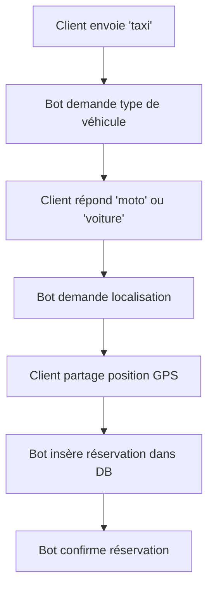

# LokoTaxi - Chatbot WhatsApp pour réservation de taxi

Ce projet implémente un chatbot WhatsApp utilisant Twilio et Supabase pour permettre aux clients de réserver des taxis (moto ou voiture) à Conakry.

## Architecture

- **WhatsApp Business API** via Twilio pour la messagerie
- **Supabase Edge Functions** (Deno) pour traiter les webhooks
- **PostgreSQL** avec PostGIS pour stocker les réservations
- **Pas de backend traditionnel** pour un déploiement rapide

## Prérequis

1. Un compte [Supabase](https://supabase.com)
2. Un compte [Twilio](https://www.twilio.com) avec WhatsApp Business API
3. [Supabase CLI](https://supabase.com/docs/guides/cli) installé localement

## Configuration de la base de données

1. Connectez-vous à votre projet Supabase
2. Exécutez le script SQL pour créer la table `reservations` :

```bash
# Via Supabase Dashboard
# SQL Editor > New Query > Coller le contenu de sql/create_reservations.sql

# Ou via CLI
supabase db push < sql/create_reservations.sql
```

## Configuration de l'Edge Function

1. Initialisez Supabase dans le projet (si ce n'est pas déjà fait) :
```bash
supabase init
```

2. Liez votre projet Supabase :
```bash
supabase link --project-ref votre-project-ref
```

3. Configurez les variables d'environnement :
```bash
# Dans Supabase Dashboard > Settings > Edge Functions
# Ajoutez (optionnel) :
TWILIO_AUTH_TOKEN=votre-auth-token-twilio
```

4. Déployez la fonction :
```bash
supabase functions deploy whatsapp-bot
```

5. Récupérez l'URL de votre fonction :
```
https://votre-project-ref.supabase.co/functions/v1/whatsapp-bot
```

## Configuration Twilio

### A. Pour les tests (Twilio Sandbox)

1. Allez dans [Twilio Console > Messaging > Try it out > Send a WhatsApp message](https://console.twilio.com/us1/develop/sms/try-it-out/whatsapp-learn)

2. Scannez le QR code avec WhatsApp ou envoyez le message indiqué (ex: `join word-word`)

3. Configurez le webhook :
   - **When a message comes in:** `https://votre-project-ref.supabase.co/functions/v1/whatsapp-bot`
   - **Method:** POST

### B. Pour la production

1. Demandez l'accès WhatsApp Business API via Twilio
2. Configurez votre numéro WhatsApp Business
3. Définissez le webhook de production dans les paramètres du numéro

## Test du chatbot

1. Envoyez `"taxi"` ou `"je veux un taxi"` au numéro WhatsApp configuré
2. Le bot demande le type de véhicule → Répondez `"moto"` ou `"voiture"`
3. Le bot demande votre localisation → Partagez votre position GPS via WhatsApp
4. Le bot confirme l'enregistrement de votre réservation

## Vérification des réservations

Dans Supabase Dashboard > Table Editor > reservations, vous verrez :
- `client_phone` : Numéro du client
- `vehicle_type` : Type de véhicule (moto/voiture)
- `pickup_location` : Coordonnées GPS
- `status` : État de la réservation (pending par défaut)
- `created_at` : Date/heure de création

## Structure du projet

```
LokoTaxi/
├── supabase/
│   └── functions/
│       ├── _shared/
│       │   └── cors.ts          # Headers CORS partagés
│       └── whatsapp-bot/
│           └── index.ts         # Logique principale du chatbot
├── sql/
│   └── create_reservations.sql  # Script de création de la table
├── CLAUDE.md                    # Instructions pour l'IA
└── README.md                    # Ce fichier
```

## Flux de conversation



## Gestion des sessions

Les sessions utilisateur sont stockées temporairement en mémoire (Map) avec un timeout de 30 minutes. Pour une solution plus robuste en production, considérez :
- Redis pour le stockage des sessions
- Une table Supabase dédiée aux sessions

## Extension future : Messages vocaux

Le code prépare déjà la gestion des messages vocaux :
1. Détection du `MediaUrl0` dans le webhook Twilio
2. Intégration future avec une API de transcription (Whisper, Azure Speech-to-Text)
3. Traitement de la transcription avec la même logique

## Sécurité

- Les Edge Functions utilisent la clé de service Supabase (gardez-la secrète)
- Validation optionnelle des webhooks Twilio via `TWILIO_AUTH_TOKEN`
- Les numéros de téléphone sont stockés sans le préfixe "whatsapp:"

## Débogage

Consultez les logs de la fonction :
```bash
supabase functions logs whatsapp-bot
```

## Support

Pour toute question ou problème :
- Documentation Supabase : https://supabase.com/docs
- Documentation Twilio WhatsApp : https://www.twilio.com/docs/whatsapp